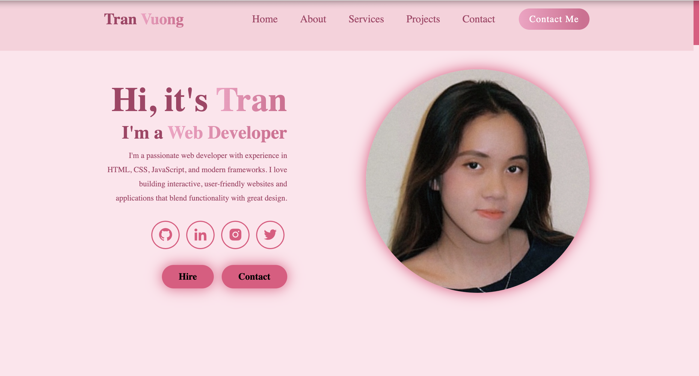
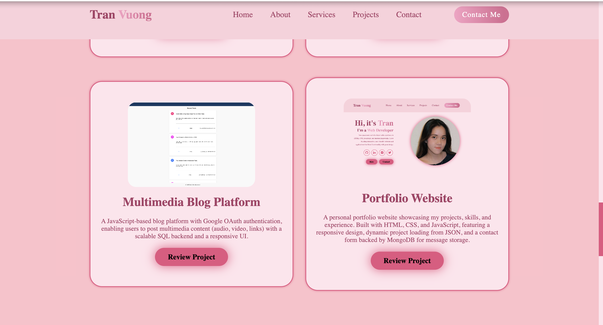

# 📌 Portfolio Website  
_A modern, responsive personal portfolio showcasing projects, skills, and experience._

---

## 🚀 Overview  
This portfolio website is built to highlight my software engineering projects, technical skills, and experience in web development.  
It includes sections for **About Me, Projects, Services, and a Contact Form** with a responsive UI.

---

## 🔹 Key Features  
✅ **Modern UI/UX** – Fully responsive and visually appealing design.  
✅ **Projects Showcase** – Displays key projects with descriptions and preview links.  
✅ **Dynamic Content** – Project data is loaded dynamically using JSON.  
✅ **Social Media Integration** – Links to GitHub, LinkedIn, and other profiles.  
✅ **Contact Form** – Users can send messages, backed by MongoDB storage.  

---

## 🛠️ Tech Stack  
- **Front-end:** HTML, CSS, JavaScript  
- **Frameworks/Libraries:** React, Vite  
- **Back-end:** Node.js, Express  
- **Database:** MongoDB (for contact form messages)  

---

## 📸 Screenshots  

### 🔹 Home Page  

### 🔹 Projects Section  

#### 📌 Project Screenshot 1  

#### 📌 Project Screenshot 2  

---

## 📦 Installation & Setup  
1️⃣ Clone the repo 
git clone https://github.com/your-username/portfolio.git  
cd portfolio

2️⃣ Install dependencies

npm install

3️⃣ Run the project locally

npm run dev
